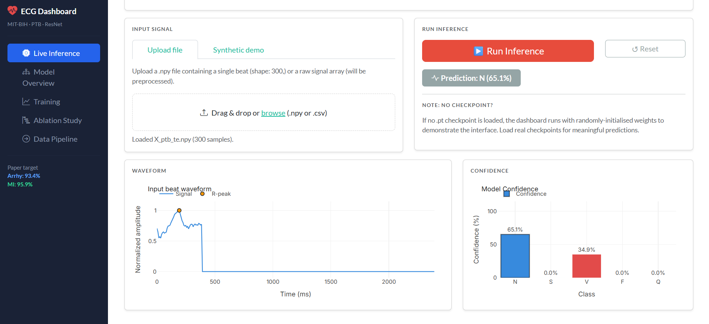
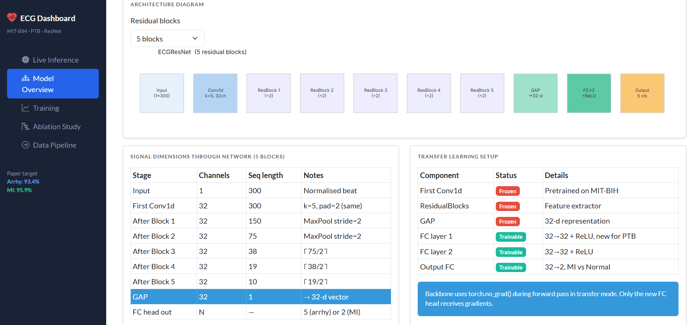
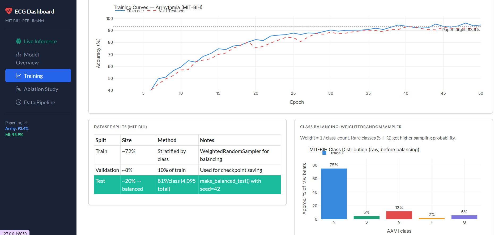
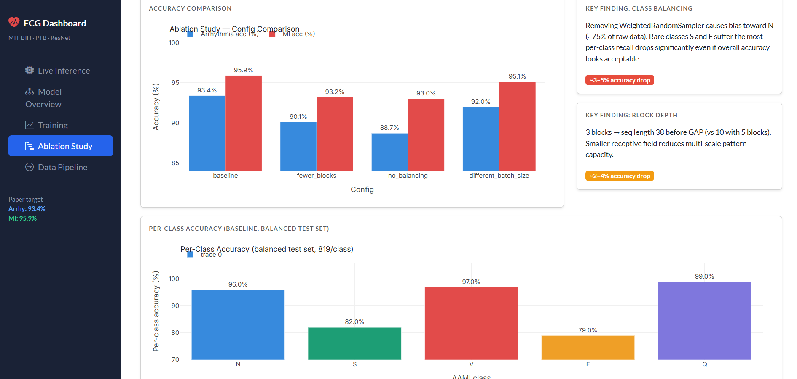
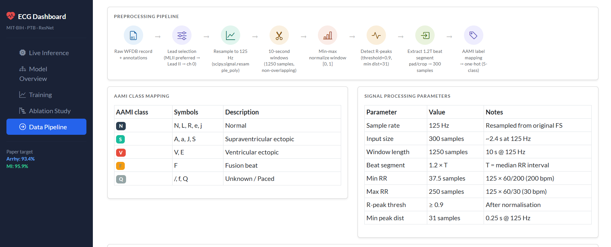

# ECG Deep Learning Dashboard

> An interactive dashboard for ECG arrhythmia classification and myocardial infarction (MI) detection using a 1-D ResNet trained on MIT-BIH and PTB datasets — built with Dash, Plotly, and PyTorch.

---

## Quick Start

```bash
git clone https://github.com/your-username/ecg-dashboard.git
cd ecg-dashboard
python -m venv .venv && source .venv/bin/activate   # Windows: .venv\Scripts\activate
pip install -r requirements.txt
python app.py
```

Then open **http://127.0.0.1:8050** in your browser.

---

## Dashboard Tabs

### 🫀 Live Inference

Upload a `.npy` beat or `.csv` signal — or pick a synthetic demo beat — then run the model and inspect the waveform and per-class confidence bars in real time.



---

### 🧠 Model Overview

Explore the full ECGResNet architecture with an interactive block count slider, a layer-by-layer dimension table, parameter counts, and the transfer-learning setup used for MI detection.



---

### 📈 Training Curves

Load your own training history (`.npy`) or view representative curves. Includes dataset split statistics, class distribution, and the WeightedRandomSampler balancing strategy.



---

### 🔬 Ablation Study

Compare four training configurations side by side — baseline, fewer residual blocks, no balancing, and smaller batch size — with per-class accuracy breakdown.



---

### 🔄 Data Pipeline

Step-by-step preprocessing reference: WFDB loading → resampling → windowing → normalisation → R-peak detection → beat extraction → AAMI label mapping.



---

## Model Architecture

```
Input (1 × 300 samples @ 125 Hz)
        │
   Conv1d  k=5, 32ch
        │
   ResidualBlock × N          ← each block: Conv→Conv→ReLU→MaxPool (stride 2)
        │
   AdaptiveAvgPool1d  →  32-d vector
        │
   FC(32→32) → ReLU → FC(32→32) → ReLU → FC(32 → num_classes)
```

| Model | Task | Classes | Dataset |
|-------|------|---------|---------|
| `ECGResNet` | Arrhythmia classification | N, S, V, F, Q | MIT-BIH |
| `ECGResNetTransfer` | MI detection (frozen backbone) | Normal, MI | PTB |

**Paper targets:** Arrhythmia **93.4%** · MI **95.9%**

---

## Loading Real Checkpoints

The dashboard runs with randomly-initialised weights for UI demonstration. For meaningful predictions:

1. Train and save checkpoints:

```python
# Arrhythmia
torch.save({"model_state": model.state_dict(), "best_val_acc": acc, "epoch": epoch}, "arrhy_best.pt")

# MI transfer
torch.save({"model_state": model.state_dict(), "best_acc": acc}, "transfer_best.pt")
```

2. In the **Live Inference** tab → enter checkpoint paths → click **Load model**.

---

## Project Structure

```
ecg_dashboard/
├── app.py                  # Entry point — Dash app, sidebar, root layout
├── callbacks.py            # All Dash callbacks (routing, inference, training …)
├── config.py               # Constants — classes, colors, ablation configs
├── figures.py              # Plotly figure builders
├── layout_helpers.py       # Reusable UI components (card, metric_card …)
├── model.py                # ECGResNet + ECGResNetTransfer definitions
├── utils.py                # Signal processing, model loader, synthetic data
├── pages/
│   ├── inference.py        # Live Inference tab
│   ├── overview.py         # Model Overview tab
│   ├── training.py         # Training tab
│   ├── ablation.py         # Ablation Study tab
│   └── pipeline.py         # Data Pipeline tab
├── assets/
│   ├── screenshot_inference.png
│   ├── screenshot_overview.png
│   ├── screenshot_training.png
│   ├── screenshot_ablation.png
│   └── screenshot_pipeline.png
└── requirements.txt
```

---

## Datasets

| Dataset | Task | Source |
|---------|------|--------|
| [MIT-BIH Arrhythmia](https://physionet.org/content/mitdb/) | 5-class arrhythmia | PhysioNet |
| [PTB Diagnostic ECG](https://physionet.org/content/ptbdb/) | MI vs Normal | PhysioNet |

---

## Dependencies

[Dash](https://dash.plotly.com/) · [dash-bootstrap-components](https://dash-bootstrap-components.opensource.faculty.ai/) · [Plotly](https://plotly.com/python/) · [PyTorch](https://pytorch.org/) · [SciPy](https://scipy.org/) · [NumPy](https://numpy.org/)
